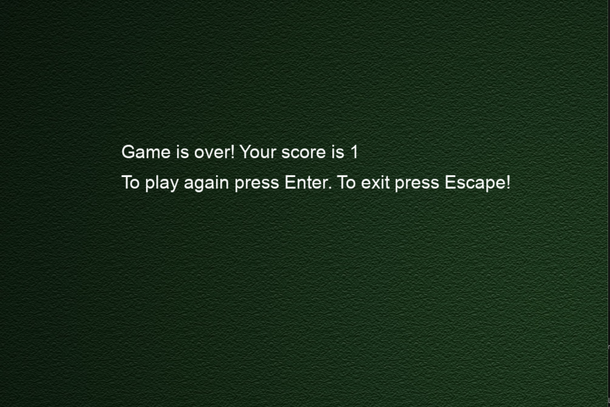

# Snake-Game
A simple Snake Game built using Python and Pygame.  
The snake grows longer when it eats apples, and the game ends when it hits the wall or collides with itself.

# Features

- 🎵 Background music

- 🔊 Sound effects (apple eat & crash)

- 🖼️ Background image support

- 🧮 Score display

- ⏸️ Pause & Resume

- 💀 Game Over screen

- 🍎 Random apple placement

- 🐍 Snake grows on eating the apple

# Controls
- ⬅️=	Move Left  
- ➡️=	Move Right  
- ⬆️=	Move Up  
- ⬇️=	Move Down  
- Enter=	Restart after Game Over  
- Escape=	Quit Game  

# How to Use
- install pygame
  - pip install pygame  
- run the game
  - python snake_game.py

# 🎮 Game Screenshots

  
  

 
# Notes
- Make sure all images and sound files exist inside a resources/ folder.  
- Sound file names must match exactly with your code.
- The game window is 1000×800, each snake block is 40px.
